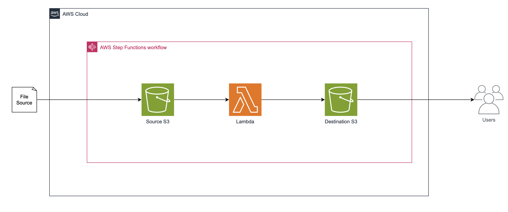

# Zomato Travel Food Analysis

This is a data extraction project that helps with data analysis. This application is a submission for the GovTech - Data Engineer Intern (Career Coach 4.0) Take Home Assignment, as a part of the interview process.

## Sections
- [Prerequisites](#prerequsities)
- [Setup Instructions](#setup-instructions)
- [Usage](#usage)
- [Cloud Deployment](#cloud-deployment)
- [Architecture Diagram](#architecture-diagram)
- [Assumptions](#assumptions)
- [Design Decisions](#design-decisions)

## Prerequisites
To run the project, ensure that the following are installed on your device.
- Python 3.x
- Jupyter Notebook
- Required Python Packages (listed in ``requirements.txt``)

## Setup Instructions
1. Clone the Repository
```bash
git clone https://github.com/aiklanggoh/zomato-travel-food-analysis.git
cd zomato-travel-food-analysis
```
2. Set up Virtual Environment
```bash
python -m venv venv
source venv/bin/activate  
# On Windows use `venv\Scripts\activate`
```
3. Install Dependencies
```bash
pip install -r requirements.txt
```

## Usage
1. Run the scripts
```bash
python3 [filename].py
```
2. Run Unit Test
```bash
pytest
```

## Cloud Deployment
If I were to design and deploy this solution, my choice would be AWS Cloud Services. I have chosen Amazon S3, AWS Lambda, and AWS Step Functions as the core components. This setup automates the process of data ingestion, transformation, and storage while ensuring the solution remains simple, scalable, and cost-effective.

### Data Ingestion and Storage
The process begins with an Amazon S3 bucket, which serves as the source repository for the ``restaurant_data.json`` file. 

### Data Processing with AWS Lambda
Once the JSON file is uploaded to the source S3 bucket, an S3 event notification triggers an AWS Step Functions workflow. The first step in this workflow invokes an AWS Lambda function, which is responsible for processing the JSON data. The Lambda function runs the Python scripts I’ve developed to extract and transform the data from the JSON format into the desired CSV format. 

### Orchestration with AWS Step Functions
AWS Step Functions orchestrate the entire data processing workflow, coordinating each step in the sequence. After the initial data transformation by the Lambda function, the workflow can include additional steps, such as validating the processed data or handling errors. Step Functions provide a clear visual representation of the workflow, making it easier to manage complex processes and monitor each step's execution.

### Storing Processed Data
Once the data extraction and transformation are completed, the final step in the Step Functions workflow stores the resulting CSV files in a separate S3 bucket. This destination bucket ensures that the processed data is securely stored and easily retrievable for future use, such as data analysis or reporting.

You will have to modify ``requirements.txt`` by adding ``boto3`` and the code ``import boto3`` in order to be cloud-deployable.

## Architecture Diagram


## Assumptions
In developing this project, the following assumptions were made:
1. **Data Availability**:
    - The main data source (``restaurant_data.json``) is assumed to be updated daily and and is placed in the specified S3 bucket. The structure of this JSON file is consistent throughout.

2. **Data Structure**
    - It is assumed that each restaurant in the JSON file has a consistent data structure, including fields such as ``id``, ``name``, ``location``, ``user_rating``, and ``zomato_events``.
    - The ``zomato_events`` field, if present, is assumed to contain a list of events, each with valid ``event_id``, ``start_date``, and ``end_date``.

3. **Date Formats**:
   - The dates in the JSON file, particularly in the ``zomato_events``, are assumed to be in the format ``YYYY-MM-DD``.

4. **Country Codes**:
   - The ``Country-Code.xlsx`` file contains valid and complete mappings between country codes and country names. It is assumed that all country codes present in the JSON data have corresponding entries in this file.

5. **Use of AWS**:
   - If deployed on AWS, it is assumed that the necessary IAM roles and permissions are correctly configured to allow the services to communicate with each other.

6. **Output**:
   - The CSV files generated by the code are assumed to be the final required format and do not require further processing. The output filenames follow the format specified in the script.

These assumptions help guide the implementation and usage of this project. If any of these assumptions do not hold true in your environment or use case, modifications to the code or additional configurations may be necessary.

## Design Decisions
1. **Use of Pandas**
    - As the secondary data source (``Country_Code.xlsx``) was in the format of ``xlsx``, there was no proprietary support for files in this format, therefore I used Pandas to extract the data into a dictionary and used it to map the ``country_id`` in the main data source.

2. **Choice of AWS Lambda for Data Processing**
    - I chose AWS Lambda as the primary compute service for processing the JSON data and generating CSV files if I were to design and deploy on cloud.
    
    The benefits of using AWS Lambda would be:
    - Serverless Architecture: Lambda allows for a fully serverless architecture, which reduces the need for server management and scales automatically based on the workload. This aligns well with the goal of processing daily data updates without requiring manual intervention.
    - Cost-Effectiveness: Lambda’s pay-per-use model ensures that costs are kept low, as we only pay for the compute time actually used during the processing of the data.
    - Integration with S3: Lambda integrates seamlessly with S3, allowing for easy triggering of functions upon the upload of a new JSON file. This event-driven model ensures that the workflow is automated and efficient.

3. **Use of Amazon S3 for Data Storage**
    - S3 was chosen to store both the input JSON files and the output CSV files.

    The benefits of using S3 would be:
    - Durability and Scalability: S3 provides 99.999999999% durability and virtually unlimited scalability, making it an ideal choice for storing both the raw JSON data and the processed CSV files.
    - Ease of Access: S3 allows easy access to the data from multiple AWS services, such as Lambda, and also provides public or restricted access to the files as needed.
    - Cost: S3 offers a low-cost storage solution, especially for the relatively small size of daily JSON and CSV files generated in this project.

4. **Use of Event-Driven Processing**
    - The processing workflow is triggered by an S3 event when a new JSON file is uploaded.

    The benefits of using event-driven processing like step functions would be:
    - Automation: Event-driven processing ensures that the workflow is fully automated, with no need for manual intervention to start the data processing. This fits the goal of minimizing operational overhead.
    - Real-Time Processing: By triggering processing as soon as new data is available, the system ensures that the CSV files are up to date with the latest data, supporting timely decision-making and reporting.